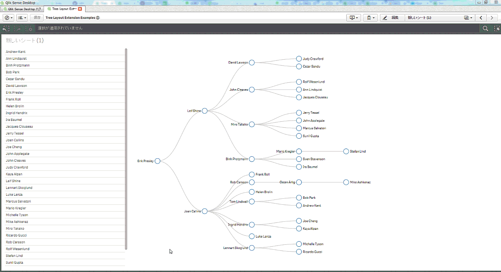

# Tree Layout Listbox
Sample listbox for D3 Tree Layout Extension

## Purpose and Description
This is a Qlik Sense listbox extension which applies selection on both selected node and its child nodes. This can be used togather with D3DynamicTreeLayout-QS extension (https://github.com/rvspt/D3DynamicTreeLayout-QS).

## Screenshots

## Installation
Qlik Sense Desktop Unzip the downloaded zip file into "C:\Users\%USERNAME%\Documents\Qlik\Sense\Extensions\" folder.

Qlik Sense Server Please refer to the following instruction for importing an extension:

Import Extension

## Change Log

See [CHANGELOG.md](ChangeLog.md)

## License & Copyright

See [LICENSE.md](License.md)
